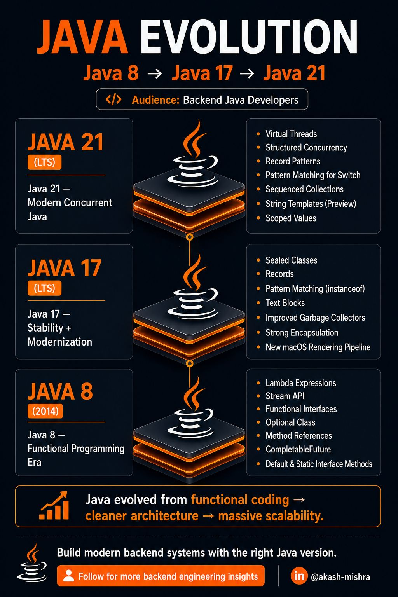
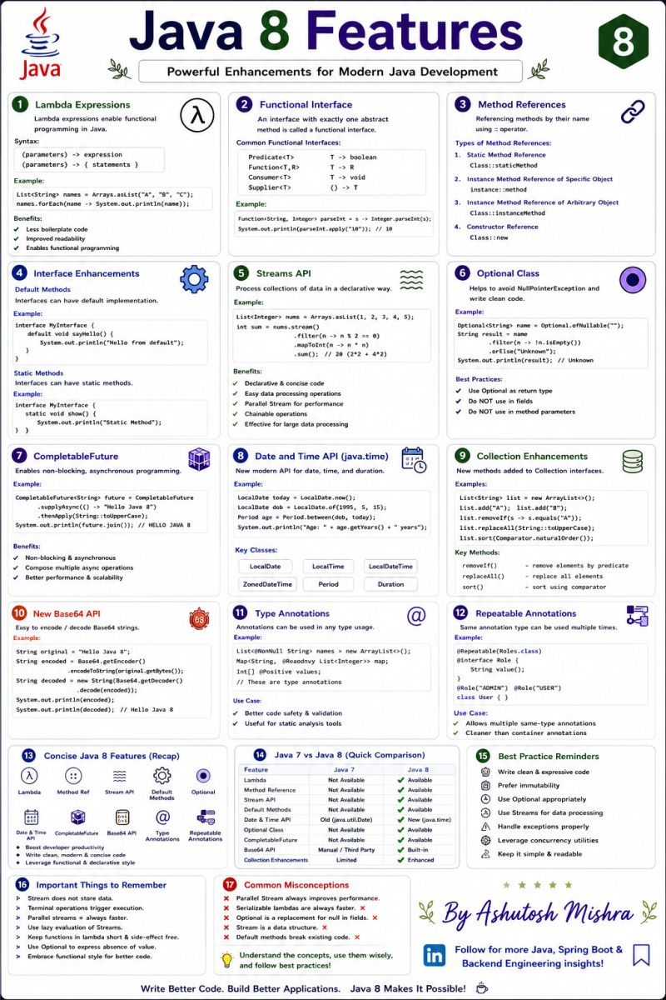
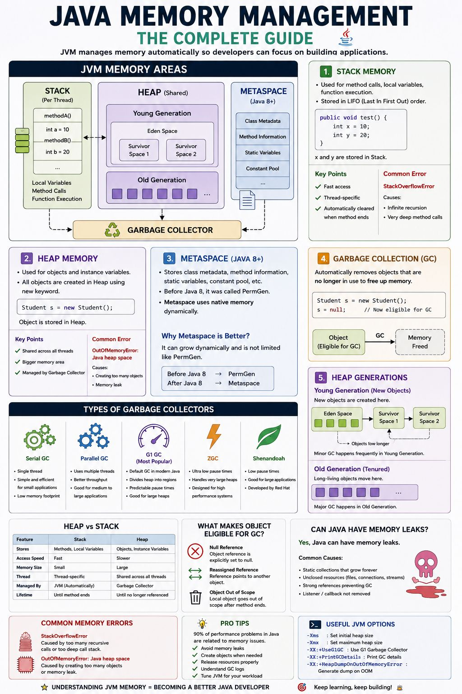

### Java-21 ###

<div style="margin-left:3rem">
   
</div>
---


## Java-8 ##

<div style="margin-left:3rem">
   
</div>


---

## Java 25 Features

**Why Upgrade to Java 25?**

- Long-Term Support (LTS)
- Better performance
- Improved concurrency
- Cleaner language syntax
- Enhanced security
- Modern JVM optimizations
- Better cloud-native support

Java 25 is a Long-Term Support (LTS) release focused on improving developer productivity, performance, security, and modern Java programming.

**1.Stable Virtual Threads**

Lightweight threads for highly concurrent applications.

Benefits:

- Millions of threads
- Lower memory usage
- Ideal for I/O-bound applications

Why to chose virtual thread of traditional thread

```
---------------------------------------------------------------------------------------------
| Traditional Thread                    |   Virtual Thread                                  |
---------------------------------------------------------------------------------------------
Scheduled & managed by the OS.          | Scheduled & managed by the JVM.
Memory usage Heavy (~1 MB per thread).  | Ultra-lightweight (a few KB on the heap).
Restricted to thousands before crashing.| Scales up to millions of active threads.
Lifecycle Pooled and carefully reused.  | short-lived, disposable, and garbage-collected.
---------------------------------------------------------------------------------------------
```

---
**2.Primitive Types in Patterns, instanceof, and switch (Preview)**

Pattern matching now supports primitive types
Cleaner switch expressions

Example:

```
switch (value) {
    case int i -> System.out.println(i);
    case long l -> System.out.println(l);
}

```
---
**3.Module Import Declarations (Preview)**

- Import all public packages from a module.
- Import module java.base;
- Reduces the need for multiple import statements.

---
**4.Flexible Constructor Bodies**

One of the biggest restrictions in Java before Java 25 was:

The first statement in a constructor had to be either super() or this().

You could not execute any code before it.

```
class Parent {
    Parent() {
        System.out.println("Parent Constructor");
    }
}

class Child extends Parent {

    Child(String name) {

        if(name == null){
            throw new IllegalArgumentException();
        }

        super();   // ❌ Compilation Error
    }
}
```
Compiler Error:

Call to super must be first statement in constructor

---
**Java 25 Solution**

```
class Child extends Parent {

    Child(String name) {

        if(name == null){
            throw new IllegalArgumentException("Invalid Name");
        }

        super();
    }
}
```
---
**Main method :**
Prior to Java 25, the main method had to be public static void main(String[] args). Starting with Java 25, Java also supports instance main methods, so static is no longer mandatory. If the main method is non-static, the Java launcher creates an instance of the class and invokes it automatically. However, in enterprise applications like Spring Boot, we still typically use the traditional static main method for compatibility and consistency.


---

## Java-Memory ##

<div style="margin-left:3rem">
   
</div>

---


