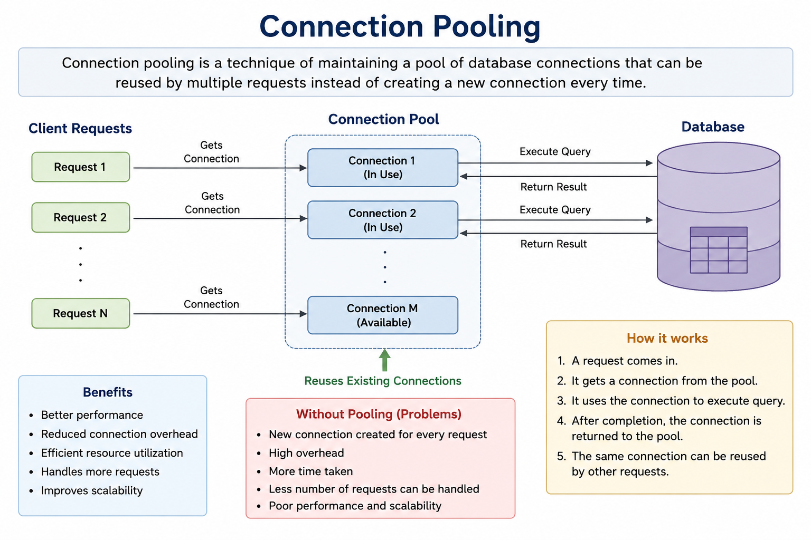
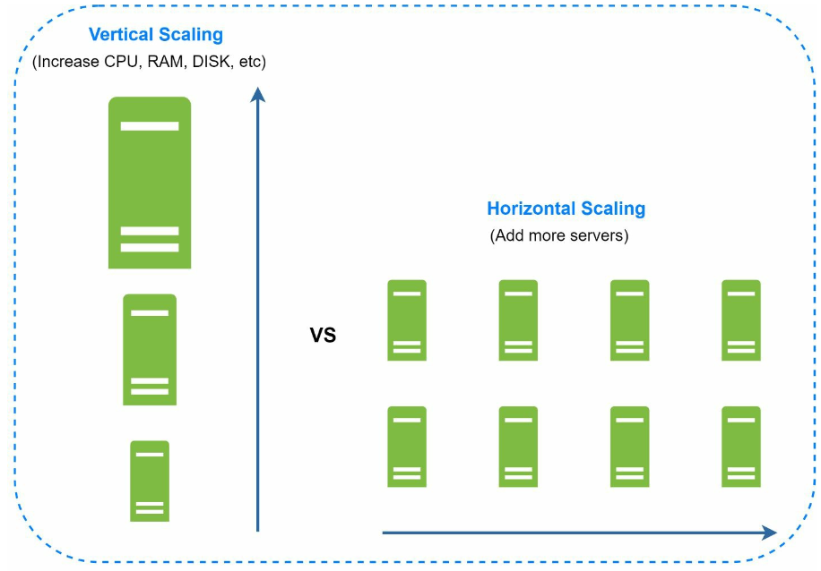

### Database Choices

1. **Relational Databases (SQL):** Structured data stored in tables. Examples: MySQL, PostgreSQL.
2. **Non-Relational Databases (NoSQL):** Suitable for unstructured data or low-latency requirements. Categories include:
   - Key-Value Stores
   - Graph Databases
   - Column Stores
   - Document Stores

- Non-relational databases might be the right choice if:
   - application requires super-low latency.
   - data is unstructured, or  there is no relational data.
   - only need to serialize and deserialize data (JSON, XML, YAML, etc.).
   - need to store a massive amount of data.

---

## Database Separation
As the user base grows, the database is moved to a dedicated server to allow independent scaling of web and database tiers.

   

---

## Connection Pooling
- Application keeps a pool of ready-to-use database connections instead of creating a new one for every request.
- Connections are created during application startup and stored in a pool.
- Requests borrow a connection from the pool and return it after use instead of closing it.
- Pool can expand up to configured max pool size during high traffic.

   

---

## Database Scaling
### Vertical Scaling
- Adds hardware resources but has physical and cost limitations.
- Has multiple drawbacks:
   -  Greater risk of single point of failures.
   -  Overall cost of vertical scaling is high

### Horizontal Scaling (Sharding)

   

- Divides data across multiple shards using keys (e.g., `user_id`).
   - Sharding separates large databases into smaller, more easily managed parts called shards.
   - Each shard shares the same schema, though the actual data on each shard is unique to the shard.
-  Sharding key is critical when implementing a sharding strategy. When choosing a sharding key it is important to choose a key that can evenly distribute data.

#### Challenges 
1. **Resharding data:** Resharding data is needed when:
   - Single shard could no longer hold more data due to rapid growth. 
   - Certain shards might experience shard exhaustion faster than others due to uneven data distribution.
   - Consistent Hashing is used to overcome these problems

2. **Celebrity problem:**  Excessive access to a specific shard could cause server overload.
   - To solve this problem, we may need to allocate a shard for each celebrity.

3. **Join and de-normalization:** Once a database has been sharded across multiple servers, it is hard to perform join operations across database shards.
   -  A common workaround is to de-normalize the database so that queries can be performed in a single table.

---

## Database Replication

   

### Master-Slave Model
- **Master Database:** Handles write operations.
   - All the data-modifying commands like insert, delete, or update must be sent to the master database.
- **Slave Databases:** Handle read operations, improving performance and reliability.
   - Since the ratio of reads to writes is higher is most applications; thus, the number of slave
databases in a system is usually larger than the number of master databases.

### Benefits
1. Improved performance through parallel read operations.
2. High availability and data reliability through redundancy.

### Failure Handling
- If only one slave database is available and it goes offline, read operations will be directed
to the master database temporarily.
- In case multiple slave databases are available, read operations are
redirected to other healthy slave databases and a new server will replace the old one. 
-  If the master database goes offline, a slave database will be promoted to be the new
master.
- In production system the chosen slave database might not be up to date, hence data needs to be updated by running data
recovery scripts (methods like multi-masters and circular replication could help).

---

