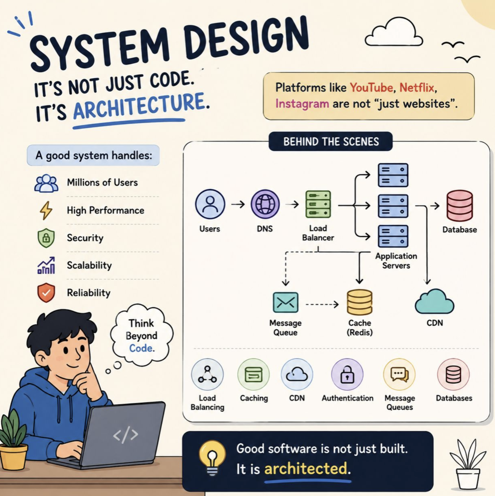
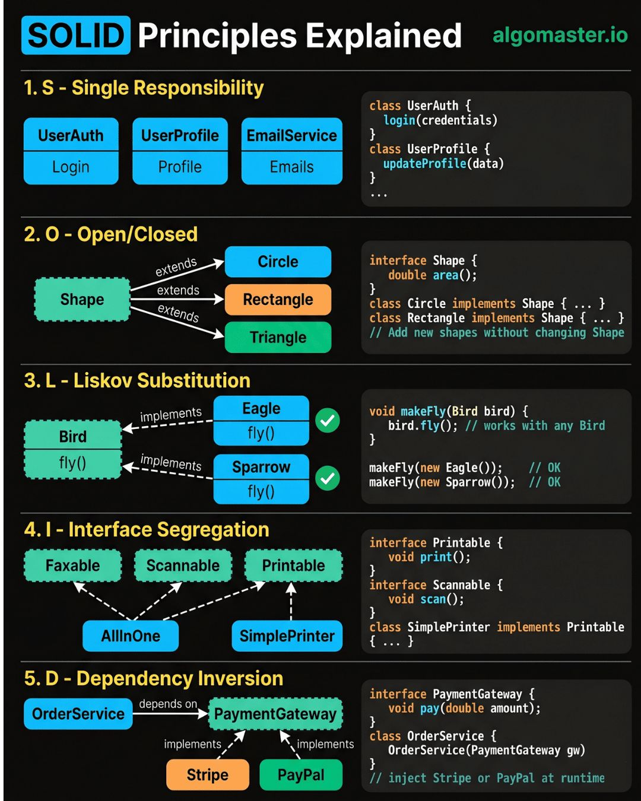
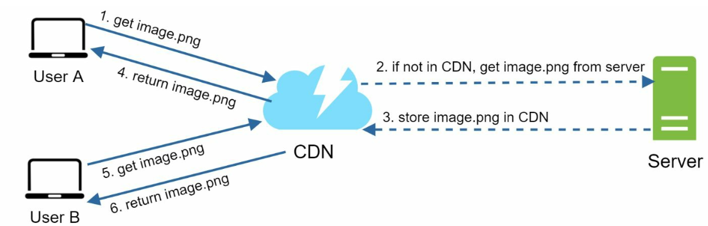
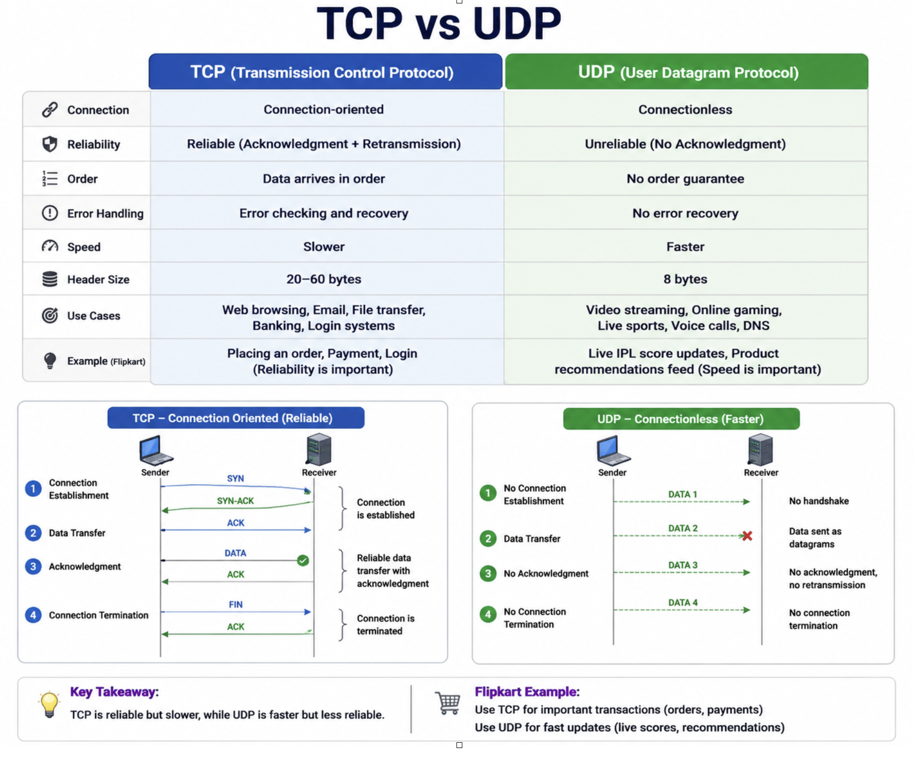
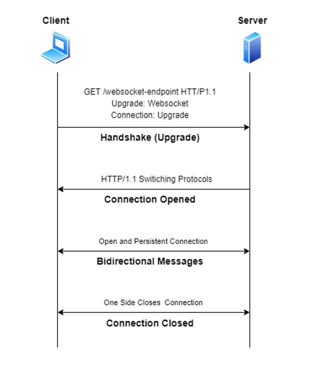
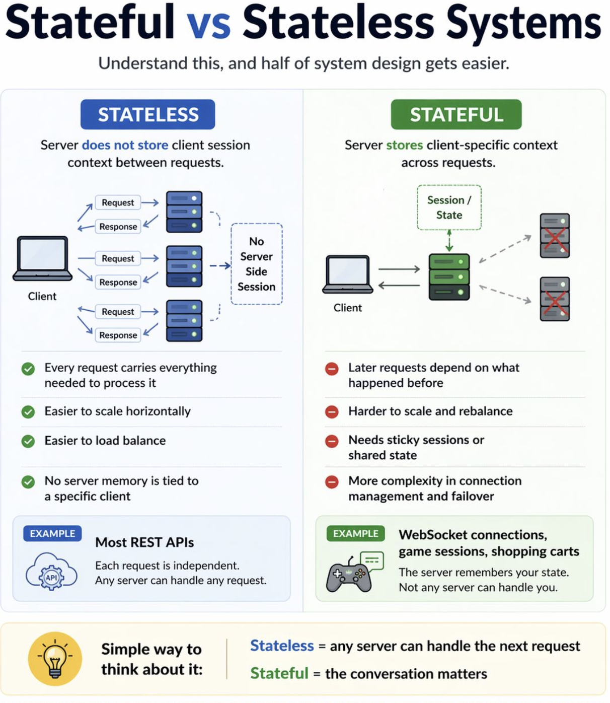
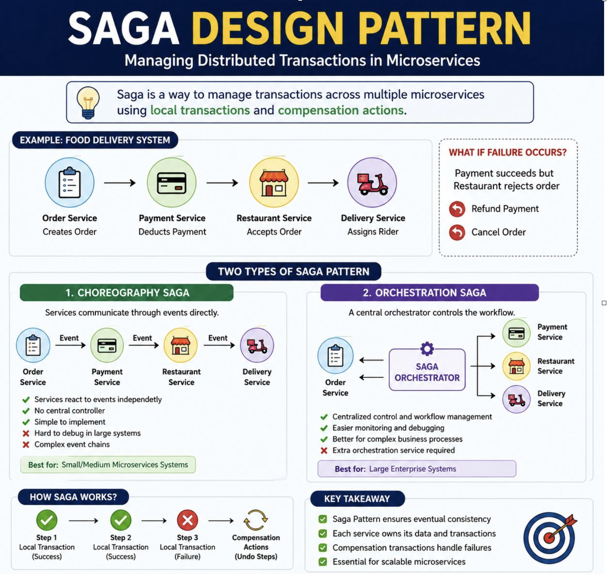
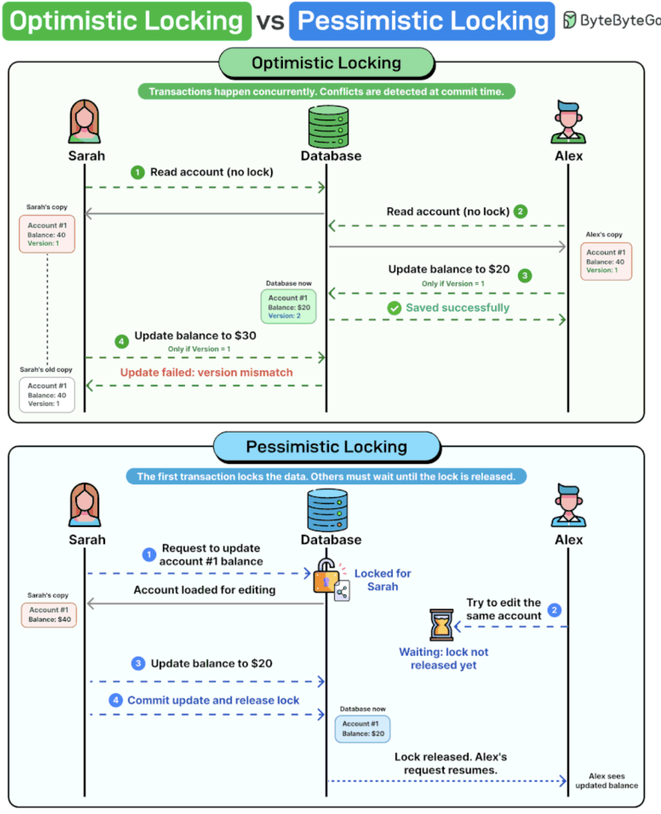
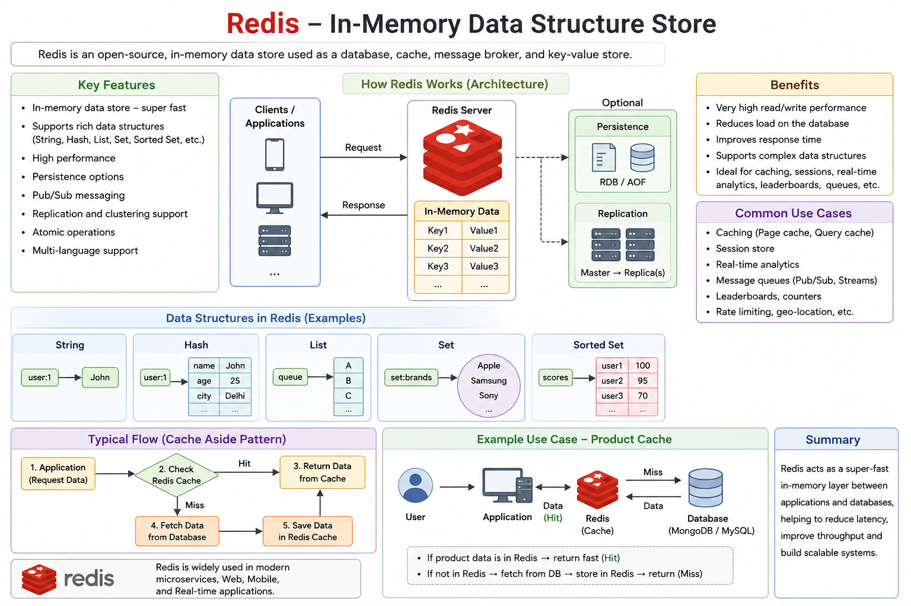
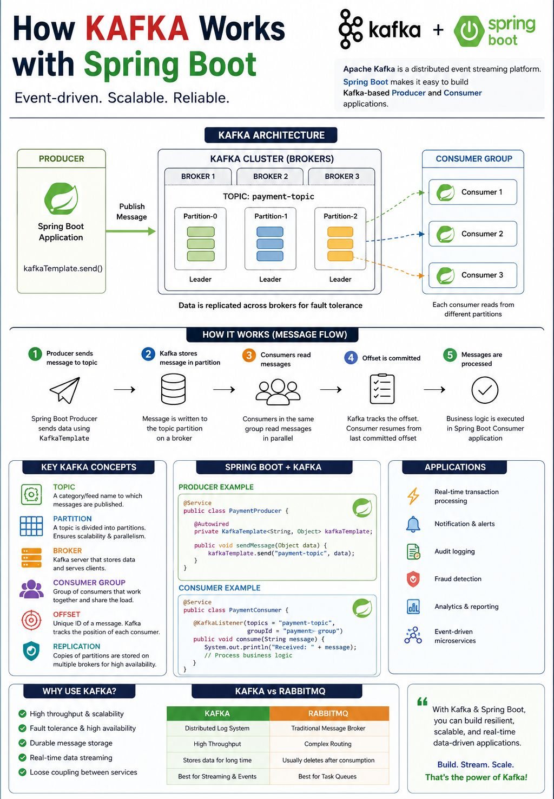

# Core Concepts of System Design

1. **Latency:** How fast a system responds to a request. Lower latency means faster response.
2. **Throughput:** How many requests a system can handle at once. Higher throughput means more work in less time.
3. **Scale:** Ability of the system to handle growth in users and traffic.
4. **Consistency:** Ensures users see accurate and up-to-date data across the system.
5. **Availability:** System remains accessible and operational even during failures.

   

---
###SOLID###

   

**1.Single Responsibility Principle (SRP)**
📌 Meaning

One class should have only one reason to change.

That means:
→ One class = One responsibility

**2.Open/Closed Principle (OCP)**
📌 Meaning

Software should be open for extension but closed for modification.

That means:
→ Add new functionality without changing old code

**3.Liskov Substitution Principle (LSP)**
📌 Meaning

Child class should be replaceable with parent class without breaking code.

That means:
→ Subclasses must behave correctly like parent class

**4.Interface Segregation Principle (ISP)**
📌 Meaning

Clients should not be forced to implement methods they do not use.

That means:
→ Small specific interfaces are better than one large interface

**5.Dependency Inversion Principle (DIP)**
📌 Meaning

High-level modules should not depend on low-level modules. Both should depend on abstraction.

That means:
→ Depend on Interface, not Implementation
---

#Scale from Zero to Millions of Users

** Introduction**
Scaling a system to support millions of users is a complex, iterative journey requiring refinement and optimization. This chapter outlines how to begin with a single server setup and scale the architecture step by step to handle millions of users.

---

**Single Server Setup**
Initially, all components (web app, database, cache) run on a single server. 

   

**Request Flow**
1. Users access the application via domain names (e.g., `api.mysite.com`), resolved to IP addresses using DNS.
2. IP address of the web-server is returned to the browser or mobile app.
3. HTTP requests are sent to the web server, which returns HTML or JSON responses.

**Traffic Sources**
1. **Web Applications:** Use server-side languages (e.g., Python, Java) for business logic and client-side languages (e.g., JavaScript, HTML) for presentation.
2. **Mobile Applications:** Communicate with the web server using HTTP and JSON for lightweight data exchange.

---

## Load Balancer

   

A **load balancer** distributes traffic among multiple servers. Benefits include:
1. Redundancy: If a server goes offline, traffic is rerouted.
   -  If server 1 goes offline, all the traffic will be routed to server 2.
2. Scalability: Easily add servers to handle traffic spikes.
   -  If the website traffic grows rapidly, subsequent servers can be added to handle the additional traffic.

---
## CORS (Cross-Origin Resource Sharing)

CORS is a browser security mechanism that controls whether a frontend application from one origin can access resources from another origin.

🌍 What is an Origin?

Origin = Protocol + Domain + Port

**Example:**

	http://localhost:3000
	
	and
	
	http://localhost:8080

are considered different origins because ports differ.

** ❌ Problem Without CORS**

&nbsp;&nbsp;&nbsp;&nbsp; Frontend:  http://localhost:3000

&nbsp;&nbsp;&nbsp;&nbsp; Backend API:  http://localhost:8080

**✅ How CORS Works**

&nbsp;&nbsp;&nbsp;&nbsp; Backend sends special headers like:

&nbsp;&nbsp;&nbsp;&nbsp; Access-Control-Allow-Origin: http://localhost:3000

Browser sees this and allows the request.

**Usually configured at:**

- API Gateway
- Nginx
- Backend service

---

## Content Delivery Network (CDN)
A **CDN** improves load times by caching static content (images, CSS, JavaScript) on geographically distributed servers.

   

### Workflow
1. User requests content from the nearest CDN server.
2. If unavailable, content is fetched from the origin server and cached.

### CDN considerations
1. **Cost:** CDNs are run by third-party providers which charge for data transfers in and out of the CDN.
2. **Cache Expiry:** The cache expiry time should neither be too long nor too short.
3. **CDN fallback:** If there is a temporary CDN outage, clients should be able to detect the problem
and request resources from the origin.
4. **Invalidating files:** If files are updated the cache should be invalidated to point to the updated files.

---

## TCP VS UDP

   

---
##WebSocket##

WebSocket is a protocol that creates a full-duplex, persistent connection between Client (Browser/App) and Server.

   

That means:

- Client can send data to server anytime
- Server can also send data to client anytime
- No need to request again and again like HTTP

It is mainly used where real-time communication is needed.

**Examples:**

	- Chat applications
	- Live cricket score
	- Stock market updates
	- Online gaming
	- Notifications
	- Live tracking (Uber, Swiggy)
	
---
##gRPC###

gRPC (Google Remote Procedure Call) is a high-performance communication framework used between microservices.

It allows one service to call another service’s method like a normal function call, even though it runs on another server.

**It uses:**

- Protocol Buffers (Protobuf) → for fast binary data serialization
- HTTP/2 → for fast transport and multiplexing

 
---
### Stateless
- Server does not store client session context between requests
- Every request carries everything needed to process it
- Easier to scale horizontally
- Easier to load balance

Example: most REST APIs

### Stateful
- Server keeps client-specific context across requests
- Later requests depend on what happened before
- Harder to scale and rebalance
- Needs sticky sessions or shared state

Example: WebSocket connections, game sessions

   

---

## SAGA

   

 **Two Types of Saga Pattern :**

**1️⃣ Choreography Saga**

Services communicate through events directly.

**Example:**

 - Order Service → publishes event

 - Payment Service → listens & processes

 - Restaurant Service → listens & processes

Each service reacts independently.

 - ✅ Simple to implement

 - ✅ No central controller

 - ❌ Hard to debug in large systems

 - ❌ Complex event chains

Best for:
 ✔️ Small/medium microservices systems

**2️⃣ Orchestration Saga**

 A central Saga Orchestrator controls the workflow.

**Example:**

Saga Orchestrator

 - Trigger Payment Service

 - Trigger Restaurant Service

 - Trigger Delivery Service

If failure occurs:

Orchestrator decides rollback steps.

  - ✅ Centralized control

  - ✅ Easier monitoring & debugging

  - ✅ Better for enterprise systems

 ❌ Extra orchestration service required

Best for:

 - Large enterprise systems

---

### Optimistic locking ### 
Assumes conflicts are rare. Both users read the data without acquiring any lock. Each record carries a version number. When a user attempts to write, the database checks: does the version in your update match the current version in the database? If another transaction already incremented the version from 1 to 2, your update still references version 1. The write is rejected.

### Pessimistic locking ###
 Takes the opposite approach. It assumes conflicts are likely, so it blocks them before they happen. The first transaction locks the row, and every other transaction waits until that lock is released. No version checks needed.

If your system is read-heavy with occasional writes, optimistic locking is the best option. When concurrent writes occur frequently and the cost of a conflict is high, pessimistic locking is the safer choice.

   

---
### Caching ###
Caching means storing frequently used data in a temporary fast storage so that next time we don’t need to fetch it again from the main database or service.

   

Instead of hitting DB every time:

App → Cache → Database

- If data is found in cache → return fast

- If not found → fetch from DB and store in cache

- This is called Cache Hit and Cache Miss

**1.Cache Aside (Lazy Loading) ← Most Common**

- Cache-aside, or lazy loading, is a strategy where the application loads data into the cache only on demand. 

- If data isn't in the cache, the app fetches it from the database, returns it, and stores it in the cache for next time. 

- This ensures only frequently used (hot) data gets cached. 

- The downside is the first request for any item will hit the database (slow), but subsequent requests are served quickly from the cache.

**2.Write-Through Caching**

- In a write-through strategy, whenever data is updated, it's written to the database and the cache at the same time. This keeps the cache up-to-date, so reads will always get fresh values from cache. 

- The benefit is consistency and no cache misses on recent writes, but the drawback is extra write overhead – each write does double work and might cache data that never gets read.

**1. Browser Cache **

Frontend side

Example:

- CSS
- JS
- Images

 **2. CDN Cache**

Stores content near user location

Example:

- Amazon CloudFront

 **3. Application Cache**

- Inside service

Example:

- Redis
- Ehcache
- Hazelcast

 **4. Database Cache**

DB internal caching

Example:

- MongoDB query cache

   

---

### CAP Theorem (System Design) ###

In a Distributed System, you can guarantee only 2 out of these 3 at the same time:

C → Consistency 

A → Availability

P → Partition Tolerance

You cannot perfectly achieve all 3 together.

** Example **

- You have 2 ATM machines connected to same bank server.

- If one ATM updates balance and network issue happens:

 **Now system must choose:**

- Show latest correct balance (Consistency)

OR

- Always give response even if old data (Availability)

 Since network failure exists (Partition), both perfect consistency + availability together is difficult.
 
---
 
###Forward Proxy and Reverse Proxy ###
 
 

   

 Proxy helps in:

	- Security
	- Load balancing
	- Caching
	- Access control
	- Monitoring
	- Performance improvement
	- Hiding internal services
	
**1. Forward Proxy** :

A forward proxy (also called a "proxy server") is a server that sits between client devices and the internet. When a client sends a request to access a website or online resource, the request is directed to the forward proxy first. The proxy then forwards the request to the destination server on behalf of the clien

Used on the client side.

Client → Forward Proxy → Internet → Server

**Use Cases**
- Enhancing client anonymity
- Accessing geo-blocked or restricted content
- Content filtering and monitoring in organizations
- Reducing bandwidth consumption through caching on the proxy server
- Logging and tracking user activity for compliance

**2. Reverse Proxy**

A reverse proxy works the opposite of a forward proxy. While a forward proxy acts on behalf of the client, a reverse proxy acts on behalf of the server. It is used to protect and manage servers by ensuring that clients do not directly communicate with the origin server.

Used on the server side.

Client → Reverse Proxy → Application Server

**Use Cases**
- Load balancing across multiple web servers
- Caching content to improve server performance
- Protecting backend servers from direct exposure to the internet
- SSL/TLS offloading to improve server efficiency
- Mitigating DDoS attacks and enhancing security

---
#Rate Limiter

** Introduction**
This chapter explores the design and implementation of a rate limiter—a system component used to control traffic rates sent by clients or services. Rate limiters are crucial for preventing abuse, reducing costs, and ensuring the stability of server resources. Examples of their use include limiting posts, account creations, and reward claims.

**Benefits of Rate Limiting**
- **Preventing DoS Attacks:** Blocking excess calls to avoid resource starvation.
- **Cost Reduction:** Limiting unnecessary requests to reduce server expenses.
- **Preventing Overloads:** Filtering out excessive requests to stabilize server performance.

**Step 1: Understanding the Problem**
**Key Features**
- Server-side API rate limiter.
- Support for multiple throttle rules.
- Handle large-scale systems in distributed environments.
- Option for a standalone service or application-level code.
- Inform users when throttled.

**Requirements**
- Accurate request throttling.
- Minimal latency.
- Low memory usage.
- Distributed capability.
- Clear exception handling.
- High fault tolerance.

**Step 2: High-Level Design**
**Placement Options**

    

1. **Client-Side Implementation:** Unreliable due to potential misuse.
2. **Server-Side Implementation:** Preferred for control and reliability.
3. **Middleware (API Gateway):** A flexible option for integrated rate limiting.

** Guidelines for Placement**
- Evaluate current tech stack and choose efficient options.
- Select appropriate algorithms based on business needs.
- Use an API gateway if microservices are employed.
- Opt for commercial solutions if resources are limited.

**Step 3: Rate Limiting Algorithms**
**1. Token Bucket**

  

- **Description:** Tokens are added to a bucket at a fixed rate; each request consumes a token.
- **Parameters:** Bucket size and refill rate.
- **Pros:** Easy to implement, memory-efficient, supports traffic bursts.
- **Cons:** Requires careful parameter tuning.

**Leaking Bucket**

  

- **Description:** Processes requests at a fixed rate using a FIFO queue.
- **Pros:** Memory-efficient, stable outflow rate.
- **Cons:** Traffic bursts may delay recent requests.
  

  Example: https://github.com/uber-go/ratelimit

**3. Fixed Window Counter**

  

- **Description:** Divides time into fixed intervals and uses counters to limit requests.
- **Pros:** Simple, efficient for specific use cases.
- **Cons:** Traffic spikes at window edges can exceed limits.

- Sudden burst of traffic at the edges of time windows
could cause more requests than allowed quota to go through.

  

**4. Sliding Window Log**

  

- **Description:** Tracks timestamps to allow a rolling time window.
- **Pros:** Accurate rate limiting.
- **Cons:** High memory consumption.
  

**5. Sliding Window Counter**

  

- **Description:** Combines fixed window and sliding log methods for smoothing spikes.
- **Pros:** Memory-efficient, handles traffic bursts.
- **Cons:** Approximation may not be perfectly strict.
  

**High-Level Architecture**

  

- **Data Storage:** Use in-memory caching (e.g., Redis) for fast counter operations.
- **Steps:**
  1. Client sends request to middleware.
  2. Middleware checks counters in Redis.
  3. Request is processed or rejected based on limits.
  
---
### KAFKA###

  

